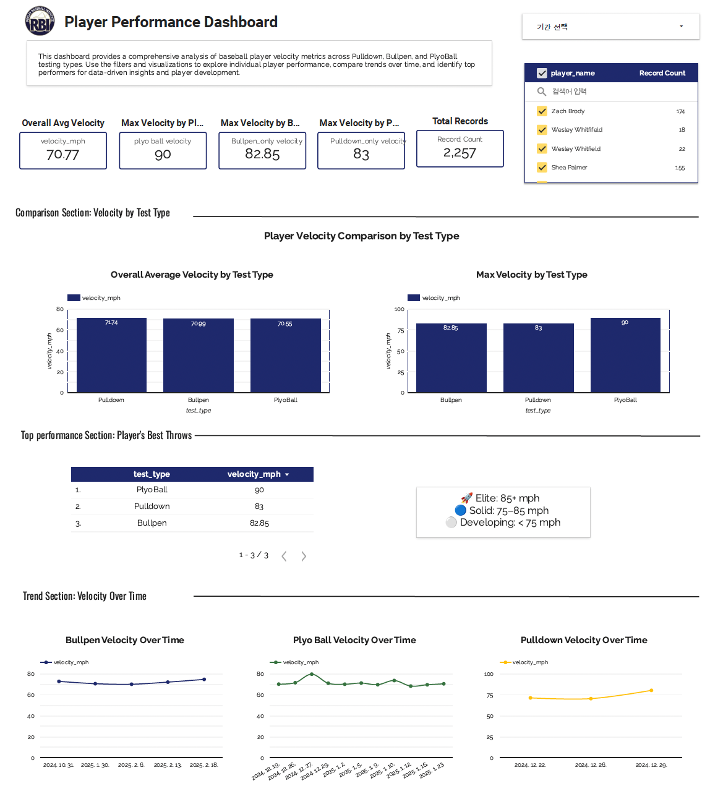
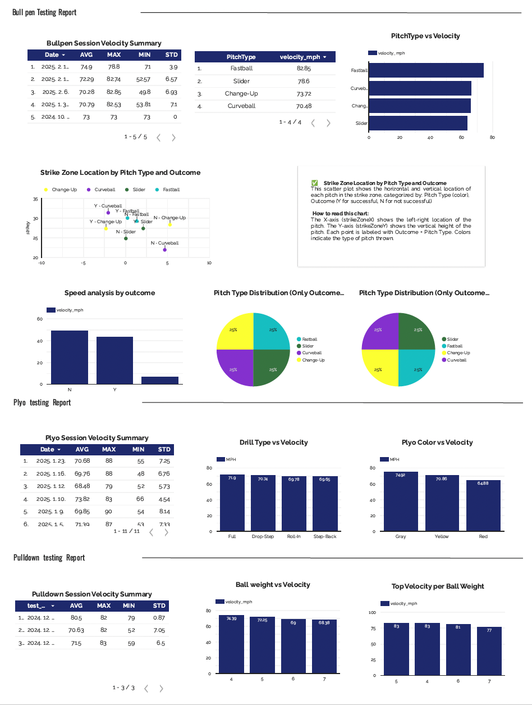

# Dasol Shin

**Baseball Operations | Player Development Analytics | Data Workflows**

I build baseball operations tools that turn tracking and game data into **coach-friendly reports, player development insights, and repeatable decision-support workflows.**

My work focuses on the intersection of **player development, analytics, and data engineering**, helping teams monitor performance, communicate insights, and support development decisions.

---

# Example Baseball Operations Outputs

## Player Development Dashboard

Example dashboard integrating **bullpen, plyo ball, and pulldown testing data** to monitor player velocity development.

Key features:

- Velocity KPI tracking (average & max)
- Player comparison across training environments
- Velocity trend monitoring
- Development classification (Elite / Solid / Developing)
- Coach-friendly performance summaries

---

## Bullpen Testing Report

Example pitching analysis report summarizing bullpen session data.

Insights include:

- Pitch velocity distribution
- Strike zone location patterns
- Pitch type usage
- Outcome-based velocity comparisons

Designed as a **coach-facing report to support development monitoring.**

---

# Baseball Analytics Projects

## Run Prevention & Pitch Strategy Analysis

Built a pitch-level decision-support framework using **4,000+ pitches (2024–2025)**.

Focus:

- matchup planning
- put-away pitch sequencing
- pitch usage analysis

Metrics engineered:

- Whiff%
- CSW%
- Chase%
- Zone / Edge classifications

Repo  
https://github.com/dasol41/run-prevention-analysis

---

## Replay Baseball Institute — Tracking Data ETL

Designed SQL pipelines integrating **HitTrax, Blast Motion, and Rapsodo data**.

Built automated dashboards and reporting workflows that reduced manual reporting time by **~40%.**

Focus:

- tracking data integration
- automated player reporting
- coach-facing analytics workflows

Repo  
https://github.com/dasol41/replay-baseball-analytics-etl

---

# Additional Projects

### Baseball Hitting Mechanics Research
Modeled bat speed from swing data (R² = 0.67) to identify biomechanical drivers of contact quality.

### MLB Attendance & Fan Engagement Forecasting
Demand forecasting using attendance, Google Trends, and Wikipedia pageviews.

Repo  
https://github.com/dasol41/mlb-attendance-digital-engagement

---

# Current Focus

Currently building a **Player Report Hub (Shiny / Streamlit demo)** designed to generate:

- one-page player reports
- KPI summaries
- performance trends
- development insights for coaches

---

# Interests

- Baseball Operations
- Player Development
- Hitting & Pitch Strategy
- Tracking Data Analytics
- Baseball Analytics Workflows

---

# Contact

GitHub  
https://github.com/dasol41

Portfolio  
https://dasol41.github.io/portfolio

Email  
dasol414@gmail.com
